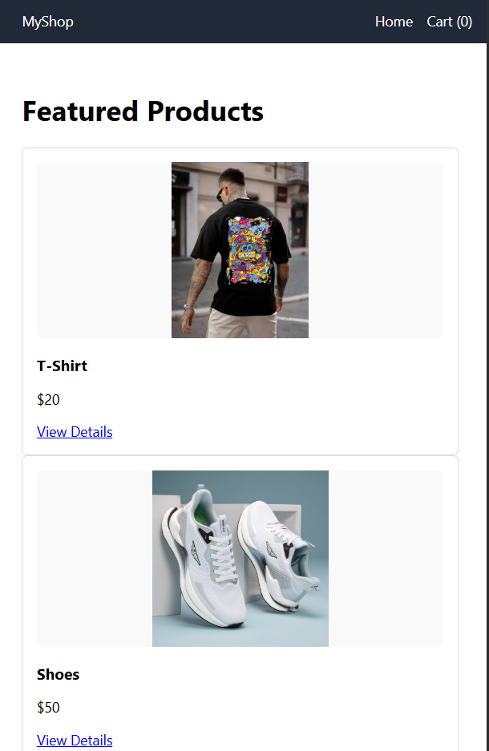

# 🛒 eCommerce Frontend Website

A responsive and modern eCommerce frontend built with **React.js**. It includes product browsing, cart management, and a checkout page — all with a clean UI and modular components.

---

## ✨ Features

- 🏠 Home page with product listings
- 🛍️ Individual product pages
- 🛒 Add to Cart / Remove from Cart
- 💳 Checkout page
- 🔄 Global state management using React Context
- 📱 Fully responsive design
- 🎨 Google Fonts for clean typography

---

## 📸 Screenshots
### 🏠 Home Page

> 

---

## 🚀 Getting Started

### 1. Clone the repository

```bash
git clone https://github.com/YOUR_USERNAME/ecommerce-frontend.git](https://github.com/KshithijSinghania/ecommerce-frontend-basic.git)
cd ecommerce-frontend
